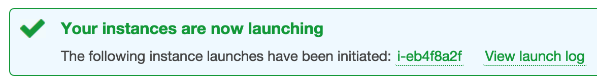
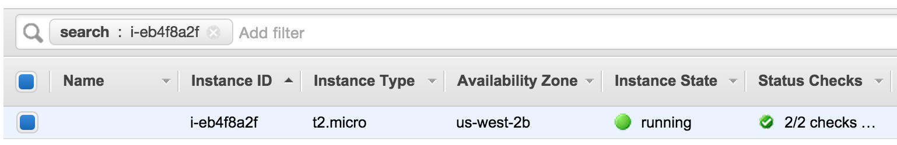

# Play / Docker / AWS Tutorial For Noobs

This tutorial explains how to:

- Install necessary tools
- Create a new Play project
- Create a new Docker image
- Run Docker image locally
- Setup AWS EC2 instance
- Publish Docker image to EC2 instance


## Step 1: Install necessary tools

### Mac OS X

Install Typesafe Activator using Brew:

```
$ brew install typesafe-activator
```

Download [Docker Toolbox](https://www.docker.com/toolbox) and install it using the installer.


## Step 2: Create a new Play project

Create a new Play project:

```
$ activator new example-app-1 play-scala
```

The command creates a new project using play-scala template. Template is fetched from [Typesafe template repository](http://typesafe.com/activator/templates). Check out the [actual template](https://typesafe.com/activator/template/play-scala).


Run the application so you can see it is working:

```
$ cd example-app-1
$ activator run
```

You should get the following result:

```
--- (Running the application, auto-reloading is enabled) ---

[info] p.c.s.NettyServer - Listening for HTTP on /0:0:0:0:0:0:0:0:9000

(Server started, use Ctrl+D to stop and go back to the console...)
```

Open browser and go to `http://localhost:9000/` and you should see the following page:


Your Play app is now created! That was easy!


## Step 3: Create a new Docker container

Go to your app directory and run the following command:

```
$ activator docker:stage
```

It will create `target/docker/stage` directory which contains all the required files for the Docker image.

So what are **image** and **container**? A **container** is a stripped-to-basics version of a Linux operating system. An **image** is software you load into a container. You build images, but when you run it, it becomes a container.

In that directory there is a file called `Dockerfile`. Add the following line to the file after RUN command:

```
EXPOSE 9000
```

After that your `Dockerfile` should look something like this:

```
FROM java:latest
WORKDIR /opt/docker
ADD opt /opt
RUN ["chown", "-R", "daemon:daemon", "."]

EXPOSE 9000

USER daemon
ENTRYPOINT ["bin/example-app-1"]
CMD []
```

This image will be based on java:latest image. It is a good idea to specify a version instead of relying on latest. But for this tutorial, we use the default value and go with the latest.

Part of the Docker Toolbox is **Docker Quickstart Terminal**. Open it and run the following command in the `stage` directory:

```
$ docker build -t example-app-1 .
```

This command reads the Dockerfile in the current directory and builds an image called **example-app-1**.

You can run the following command and verify the new image is on your computer.

```
$ docker images
REPOSITORY          TAG                 IMAGE ID            CREATED             VIRTUAL SIZE
example-app-1       latest              89e9d439ef8d        8 minutes ago       894.1 MB
```


## Step 4: Run docker image locally

Run the image using the following command:

```
$ docker run --name example-container-1 -d -p 80:9000 example-app-1
[info] - play.api.Play - Application started (Prod)
[info] - play.core.server.NettyServer - Listening for HTTP on /0:0:0:0:0:0:0:0:9000
```

This will create a new container by name `example-container-1` and it will serve our app in port `80`. `-d` argument makes the Docker container run in the background.


But how do you open your app in browser? You need the IP address of the container. But how do you know what is the IP address?

On Linux machine you can use localhost. On Mac, docker machine is running on VirtualBox and by default port forwarding to localhost is not set.

One easy way to find the IP address is to use the following command:

```
$ docker-machine inspect default | grep IPAddress
        "IPAddress": "192.168.99.100",
```

So, now you can open your browser and go to `http://192.168.99.100/` and you should see a text saying "Your new application is ready". Wohoo, your app is running inside the Docker container!

Now you can stop your app:

```
$ docker stop example-container-1
```


## Step 4: Setup AWS EC2 instance

Go to [AWS Web Page](https://aws.amazon.com) and click `Sign In to the Console` button. From there you can create a new Amazon account or log in if you already have an account.

After logging in, select `EC2 (Virtual Servers in the Cloud)` from the service list. Amazon EC2 instance is a virtual server which will eventually host your Docker container.

Next, click `Launch Instance` button. This will start a wizard.

###Step 1: Choose an Amazon Machine Image (AMI)

From the list select the first option which should be **Amazon Linux AMI**. Notice, that this AMI is included in the free tier which means you can try and run it for free.

###Step 2: Choose an Instance Type

By default `t2.micro` type is selected. If it is not, select it. This **free** option is good testing and playing around.

Click `Next: Configure Instance Details` to continue.

###Step 3: Configure Instance Details

Make sure the number of instances is `1`.

Click `Next: Add Storage` to continue.

###Step 4: Add Storage

In here you can accept the default values. You should have one Root volume and nothing more.

Click `Next: Tag Instance`

###Step 5: Tag Instance

You don't have to do anything here.

Click `Next: Configure Security Group`

###Step 6: Configure Security Group

You have to create a new security group which basically defines what kind of traffic is allowed to your instance. By default SSH is enabled from **anywhere**.

Because our plan is to run a web app, we need to open port 80 (HTTP) for it. Click `Add Rule` and select `HTTP type`. That is all you have to do.

Click `Review and Launch` to continue.

###Step 7: Review Instance Launch

Amazon will nag you about the open SSH rule but this is just a testing instance, so you don't have to worry about it. You can review all the things you did and finally click `Launch`

You will probably get a popup asking about key pair. We assume you don't have it yet so select `Create a new key pair`. Then give a name for your key pair. In this tutorial we assume the key is called `test-aws-key`. Click `Download Key Pair`

Download the file, save it to a secure location and don't loose it! You will need it later!

Finally click `Launch Instances` and your instance will be initiated.



Click to instance id to open the details of your brand new instance.



Here you can see all the instances. When know the instance is up and running when Instance State has a green circle with the text `running`.

One more stop to go!


### Step 5: Publish image to EC2 instance

This tutorial will use [Docker Hub](https://hub.docker.com/) for storing the Docker image. First we will publish the image to Docker Hub and then we fetch it from there and save to EC2 instance.

Create yourself a Docker Hub account if you don't have it yet and log in. You can create an account from the command line, but let's not go there.

Next you have to create a new repository for your container so click `Create Repository` button.

Give your repository a name. For this tutorial we will use `example-repo-1`. You can leave descriptions empty and visibility to public. You can also create private repos, but for the sake of simplicity we use public repo.

First we need to log in using docker:

```
$ docker login
```

This will asked your credentials and save them for the future use.

Go to your `stage` folder and run the following commands:

```
$ docker build -t yourusername/example-repo-1 .
$ docker push yourusername/example-repo-1
```

This will build a new image for the repository. The second command uploads the created image to the repository. Be patient because this might take awhile.

Remember the key you made before? Now you need it. Go to the directory where you saved the key file `test-aws-key.pem´.

You have to check the IP address of the instance from the AWS console. Select `EC2`, then `Instances` and finally select your instance. Now click `Connect` and you'll get a popup guiding the next steps:

```
$ chmod 400 test-aws-key.pem
$ ssh -i "test-aws-key.pem" ec2-user@YOURIPADDRESS
```

Now you are connected to your instance. Run the following command to update the instance:

```
$ sudo yum update
```

Then you have to install Docker:

```
$ sudo yum install -y docker
```

...and launch the Docker service:

```
$ sudo service docker start
```

...and add current user to docker group:

```
$ sudo usermod -a -G docker ec2-user
```

Now log out using `exit` command and log back in using ssh just like before. Then pull the image from the repository:

```
$ docker pull yourusername/example-repo-1
```

And finally we can run the image:

```
$ docker run --name example-app-1 -d -p 80:9000 yourusername/example-repo-1
```

If you open your instance IP to browser you should see the page saying `Your new application is ready."

You are done! Your Play application is now running on AWS!


