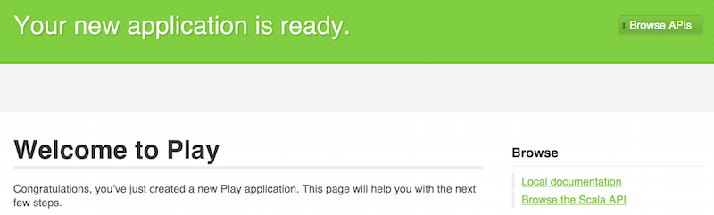

# play-docker-aws-tutorial
101 tutorial for publishing Play app to Amazon Web Services (AWS) using Docker. This tutorial explain the following steps:

- How to create a new Play project
- How to create a new Docker container
- How to setup AWS EC3 instance
- How to publish container to EC3 instance

## Step 1: Create a new Play project

Create a new app using `Activator`

```
$ activator new example-app-1 play-scala
```
Test that the app is working

```
$ cd example-app-1
$ activator run
```

You should get the following result:

```
--- (Running the application, auto-reloading is enabled) ---

[info] p.c.s.NettyServer - Listening for HTTP on /0:0:0:0:0:0:0:0:9000

(Server started, use Ctrl+D to stop and go back to the console...)
```

Open browser and go to http://localhost:9000/ and you should see the following page.




## Step 2: Create a new Docker container
**TODO**

## Step 3: Setup AWS EC3 instance
**TODO**

## Step 4: Publish container to EC3 instance
**TODO**
